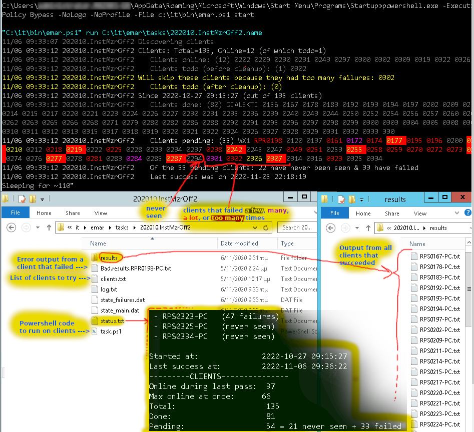

emar, Easy MAnagment of Remote tasks
------------------------------------

emar helps you run a powershell function on many client-PCs and get back
results (if any). 
Your function may do anything powershell can do except
return back huge amounts of data. All in all emar is a glorified wrapper 
around Invoke-Command with extra logic to:

 - Detect online clients (responding to ping) and only attempt tasks on them 
    
 - Periodicly retry failed clients
    
 - Collect errors & results. Log errors and store results in files
    
 - Nice logs and reports (more lines of code than I thought)
    
 - Easily run more than one tasks (just create more tasks - nothing else to do)
    
emar relies on PowerShell remoting so you need to enable it on your clients. 

Getting started
---------------

 0) On the clients enable PowerShell remoting and test by running
        EnterPSSession "Client-Computer-Name"
    from the server.
    
    All other steps are on the server.
    
 1) Create a directory for emar to work in ($base_dir).

        $base_dir="c:\it\emar" 
        mkdir -force $base_dir

 2) Select an id for your first task ($task_id) and mkdir $base_dir\$task_id
    I use this style '202010_Inst_Chrome' (for 2020-Octomber, install chrome)
    The id can be anything you like but don't start it with _
    (and no, don't use spaces -- use something like a variable name).
    
        mkdir $base_dir\202011.testemar

 3) Write a function and put it in $base_dir\$task_id\task.ps1
    The last (and maybe only) thing your function should return is the text 
    <SUCCESS> if it's job was done succesfully - anything else if not.
    You can write code to collect data from the clients or to perform 
    jobs like installing software.
    
    It's probably good to abort on any error.
    
    It's also a good idea to return clixml or json.
    
    It's a bad idea to return huge amounts of data (they are collected
    
    in memory from all clients before getting written to disk)

        notepad $base_dir\202011.testemar\task.ps1
        #------------------------------------------------------------
        # How much time your function needs to complete 
        # (worst-case scenario )
        $script:TIMEOUT = 300

        function ClientTask() {
            # stop on any error
            $ErrorActionPreference = "Stop" 
            # Invoke-webrequest and others will not display progress
            $ProgressPreference = 'SilentlyContinue'    
            ...YOUR CODE HERE...
            if ($check_if_all_good) {
                echo "<SUCCESS>"
            } else {
                echo "HUSTON WE'VE HAD A PROBLEM"
            }    
        }
        #------------------------------------------------------------

 4) create a text file $base_dir\clients.txt with a list of computer names 
    (one per line) were you want to run your task on
    
        echo 'test-pc' > $base_dir\202011.testemar 

 5) Execute emar

        emar.ps1 -command start -base_dir $base_dir

 6) As tasks run on clients:
 
    Output of sucessful tasks is saved in:
    
        $base_dir\$task_id\results\<computer_name>.txt
        
    Outpute of unsuccesful tasks in:
    
        $base_dir\$task_id\bad.results.<computer_name>.txt
        
    A nice summary of the current status is in:
    
        $base_dir\$task_id\status.txt
        
    Detailed logs are written in:
    
        $base_dir\$task_id\log.txt
        
    Status messages are printed on screen

An ugly outlook of emar
-----------------------

